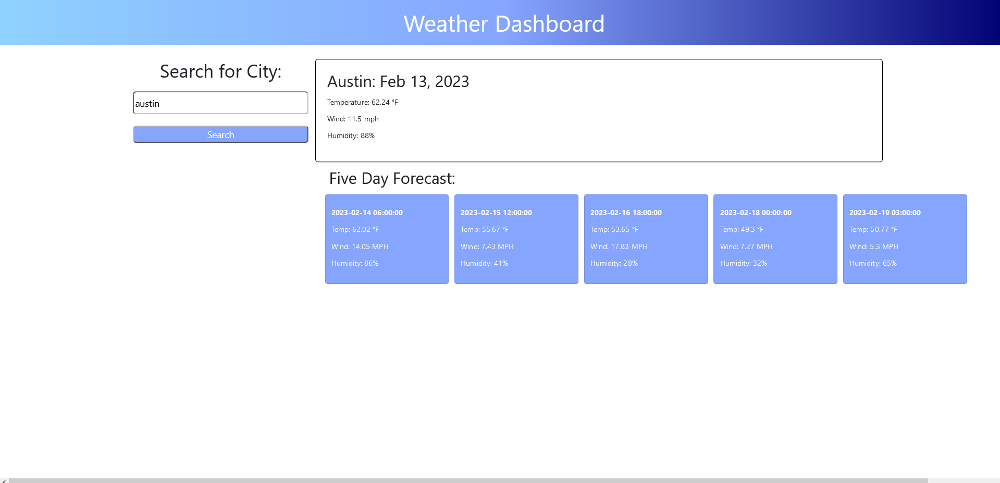

# The Weather Application

## Description

My motivation to build this project was to create an application where somebody could look up the current weather in any city in the United States, as well as see the five day forecast for that same city with one click of a button. This application can give someone a weather update including temperature, wind speed and humidity from their mobile device or desktop. I learned a lot of new things from building this project, but the main thing was how to fetch third party API's, and get its data to render to the page.

## Installation

N/A

# Usage

To use this appication simply type in a city in the searchbar and click search. After that watch the current weather along with a five day forecast pop up on your screen!

# Credits

GitHub URL: https://github.com/CoreyDC/the-weather-application

Deployed URL: https://coreydc.github.io/the-weather-application/
